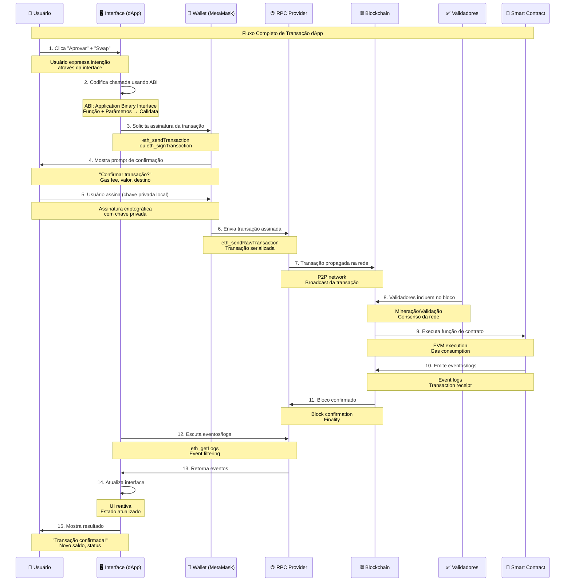
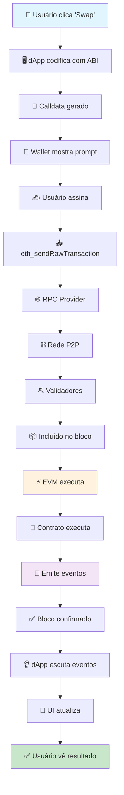
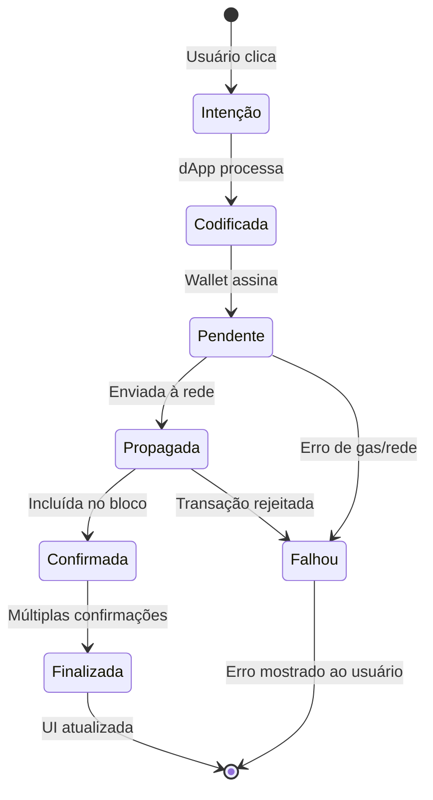

# Ethereum Smart Contracts - Educational Repository

## 🎓 About This Repository

This repository is designed for **educational purposes** for students at **UFES (Universidade Federal do Espírito Santo)**. It contains comprehensive examples and implementations of Solidity smart contracts, covering fundamental concepts, security patterns, and best practices in blockchain development.

## 📚 Learning Objectives

This repository demonstrates:

- **Basic Solidity Concepts**: Variables, functions, visibility modifiers
- **Advanced Patterns**: Interfaces, abstract contracts, inheritance
- **Security Concepts**: Reentrancy attacks and protection mechanisms
- **Testing**: Comprehensive test suites with Foundry
- **Best Practices**: Code organization, error handling, and gas optimization

## 🏗️ Repository Structure

```
src/
├── Counter.sol                # Basic counter contract
├── Functions.sol              # Function visibility and modifiers
├── Variables.sol              # Variable types and scopes
├── ReceiveFallback.sol        # Receive and fallback functions
├── InterfaceAbstract.sol      # Interfaces and abstract contracts
├── projects/
│   ├── ClassVote.sol          # Voting system with phases
│   ├── Escrow.sol             # Escrow system with arbitration
│   ├── SafePiggy.sol          # Contract with security patterns
│   ├── TimeLockVault.sol      # Time-locked vault system
│   └── StakeToken.sol         # ERC20 with mint/burn + staking points
└── ReentrancyAttacker.sol     # Malicious contract for testing

test/
├── Counter.t.sol              # Tests for counter contract
├── Functions.t.sol            # Tests for function concepts
├── Variables.t.sol            # Tests for variable concepts
├── ReceiveFallback.t.sol      # Tests for receive/fallback
├── InterfaceAbstract.t.sol   # Tests for interfaces/abstract
├── ClassVote.t.sol            # Tests for voting system
├── Escrow.t.sol               # Tests for escrow system
├── SafePiggy.t.sol           # Comprehensive security tests
├── TimeLockVault.t.sol        # Tests for time lock vault
└── StakeToken.t.sol          # Tests for ERC20 stake token
```

## 🚀 Getting Started

### Prerequisites

- [Foundry](https://book.getfoundry.sh/getting-started/installation)
- Git
- Node.js (para o projeto Web3)
- Chave privada para deploy (opcional)

### Installation

```bash
# Clone the repository
git clone <repository-url>
cd eth-ufes

# Install dependencies
forge install

# Build the project
forge build

# Configure environment (opcional)
cp env.example .env
# Edite o arquivo .env com suas configurações
```

### OpenZeppelin Contracts (Required for ERC20 Token)

```bash
# Install OpenZeppelin contracts library
forge install OpenZeppelin/openzeppelin-contracts --no-commit
```

## 🚀 Deploy de Contratos

### Configuração Inicial

1. **Configure suas variáveis de ambiente:**
```bash
cp env.example .env
```

2. **Edite o arquivo `.env` com suas configurações:**
```env
# Chave privada (sem 0x)
PRIVATE_KEY=your_private_key_here

# RPC URLs
ETHEREUM_HOLESKY_RPC=https://sepolia.infura.io/v3/YOUR_INFURA_PROJECT_ID
POLYGON_RPC_URL=https://polygon-mainnet.infura.io/v3/YOUR_INFURA_PROJECT_ID
AMOY_RPC_URL=https://polygon-amoy.infura.io/v3/YOUR_INFURA_PROJECT_ID

# API Keys para verificação
ETHERSCAN_API_KEY=your_etherscan_api_key
POLYGONSCAN_API_KEY=your_polygonscan_api_key
```

### Deploy Individual

```bash
# Deploy Counter
make deploy-counter network=sepolia

# Deploy ClassVote
make deploy-class-vote network=sepolia

# Deploy Escrow
make deploy-escrow network=sepolia

# Deploy TimeLockVault
make deploy-time-lock network=sepolia

# Deploy SafePiggy
make deploy-safe-piggy network=sepolia
```

**Nota:** Os scripts agora usam automaticamente a `PRIVATE_KEY` configurada no arquivo `.env`. Não é necessário passar a chave privada como parâmetro.

### Deploy Todos os Contratos

```bash
# Deploy todos os contratos em Sepolia
make deploy-all network=sepolia

# Deploy todos os contratos em Polygon
make deploy-all network=polygon

# Deploy todos os contratos em Amoy
make deploy-all network=amoy

# Deploy com verificação automática
make deploy-verify network=sepolia
```

### Deploy Local (Desenvolvimento)

```bash
# Iniciar rede local
make anvil

# Em outro terminal, deploy local
make deploy-local
```

### Redes Suportadas

| Rede | Comando | Chain ID |
|------|---------|----------|
| Ethereum Mainnet | `make deploy-all network=ethereum` | 1 |
| Sepolia Testnet | `make deploy-all network=sepolia` | 11155111 |
| Polygon Mainnet | `make deploy-all network=polygon` | 137 |
| Polygon Amoy | `make deploy-all network=amoy` | 80002 |
| Local (Anvil) | `make deploy-local` | 31337 |

### Verificação de Contratos

```bash
# Verificar contrato específico
forge verify-contract <CONTRACT_ADDRESS> <CONTRACT_PATH> --etherscan-api-key <API_KEY>

# Verificar todos os contratos (automático com deploy-verify)
make deploy-verify network=sepolia
```

### Monitoramento de Deploy

```bash
# Deploy com logs detalhados
make deploy-verbose network=sepolia

# Verificar informações da rede
make network-info network=sepolia

# Verificar saldo da conta
make check-balance ADDRESS=<YOUR_ADDRESS> network=sepolia
```

### Endereços dos Contratos

Após o deploy, os endereços dos contratos são salvos em `deployed-contracts.json`:

```json
{
  "contracts": {
    "counter": "0x...",
    "classVote": "0x...",
    "escrow": "0x...",
    "timeLockVault": "0x...",
    "safePiggy": "0x..."
  }
}
```

### Integração com Web3

Os endereços dos contratos deployados podem ser usados no projeto Web3:

```bash
# Copie os endereços para o projeto Web3
cd app-web3
cp ../deployed-contracts.json .

# Configure no .env do projeto Web3
COUNTER_CONTRACT_ADDRESS=0x...
CLASS_VOTE_CONTRACT_ADDRESS=0x...
ESCROW_CONTRACT_ADDRESS=0x...
TIME_LOCK_VAULT_CONTRACT_ADDRESS=0x...
SAFE_PIGGY_CONTRACT_ADDRESS=0x...
```

## 🌐 Projeto Web3 - Interações com Contratos

O projeto inclui um sistema modular para interações com contratos usando ethers.js:

### Estrutura do Projeto Web3

```
app-web3/
├── src/
│   ├── config/          # Configurações centralizadas
│   ├── contracts/        # Classes para cada contrato
│   ├── utils/           # Utilitários (provider, etc.)
│   └── abis/            # ABIs dos contratos
├── examples/            # Exemplos de uso
├── index.js            # Arquivo principal
└── README.md           # Documentação completa
```

### Uso do Projeto Web3

```bash
# Navegar para o projeto Web3
cd app-web3

# Instalar dependências
npm install

# Configurar variáveis de ambiente
cp env.example .env
# Edite o .env com suas configurações

# Executar sistema
npm start

# Exemplos
node examples/basic-usage.js
node examples/advanced-usage.js
```

### Integração Completa

1. **Deploy dos contratos:**
```bash
make deploy-all network=sepolia
```

2. **Configure o projeto Web3:**
```bash
cd app-web3
# Copie os endereços do deployed-contracts.json para o .env
```

3. **Teste as interações:**
```bash
npm start
```

## 🧪 Running Tests

### Run All Tests
```bash
forge test
```

### Run Specific Test Suites
```bash
# Test basic functions
forge test --match-contract FunctionsTest

# Test variables
forge test --match-contract VariablesTest

# Test receive/fallback
forge test --match-contract ReceiveFallbackTest

# Test interfaces and abstract contracts
forge test --match-contract InterfaceAbstractTest

# Test security patterns
forge test --match-contract SafePiggyTest

# Test voting system
forge test --match-contract ClassVoteTest

# Test escrow system
forge test --match-contract EscrowTest

# Test time lock vault
forge test --match-contract TimeLockVaultTest

# Test counter contract
forge test --match-contract CounterTest
```

### Run Tests with Verbose Output
```bash
forge test -vv
```

## 🪙 ERC20 Stake Token (StakeToken.sol)

### Overview

- ERC20 token with:
  - Owner minting
  - Holder burning
  - Simple staking that accrues time-based points
- Points rate: 1 point per staked token per hour.
- Points are non-transferable; claim via `claimPoints()`.

### Key Functions

- `mint(address to, uint256 amount)` (onlyOwner)
- `burn(uint256 amount)`
- `stake(uint256 amount)` / `unstake(uint256 amount)`
- `claimPoints() returns (uint256)`
- Views: `pointsOf(address)`, `stakedOf(address)`

### Install Dependency

```bash
forge install OpenZeppelin/openzeppelin-contracts --no-commit
```

### Build

```bash
forge build
```

### Run Only Stake Token Tests

```bash
forge test --match-contract StakeTokenTest -vv
```

### Files

- Contract: `src/projects/StakeToken.sol`
- Tests: `test/StakeToken.t.sol`

## 📖 Educational Content

### 1. **Function Visibility and Modifiers** (`Functions.sol`)
- **Public, Internal, Private** functions
- **Pure vs View** functions
- **Payable** functions
- **Blockchain data** access (block.timestamp, msg.sender, etc.)

### 2. **Variable Scopes** (`Variables.sol`)
- **Public, Internal, Private** variables
- **State variables** vs **local variables**
- **Storage** vs **memory** vs **calldata**

### 3. **Receive and Fallback Functions** (`ReceiveFallback.sol`)
- **Receive()** function for direct ETH transfers
- **Fallback()** function for unknown function calls
- **Event logging** for transaction tracking

### 4. **Interfaces and Abstract Contracts** (`InterfaceAbstract.sol`)
- **Interface** definition and implementation
- **Abstract contracts** forcing child implementation
- **Inheritance** patterns
- **Virtual** and **override** keywords

### 5. **Security Patterns** (`SafePiggy.sol`)
- **Reentrancy protection** with modifiers
- **Pull over Push** pattern
- **CEI pattern** (Checks-Effects-Interactions)
- **Custom errors** for gas optimization
- **Access control** with owner patterns

### 6. **Reentrancy Attack Demonstration** (`ReentrancyAttacker.sol`)
- **Malicious contract** for testing
- **Real reentrancy attack** implementation
- **Vulnerable vs Secure** function comparison

### 7. **Voting System** (`ClassVote.sol`)
- **Phase-based voting** (Setup, Voting, Ended)
- **One vote per address** enforcement
- **Admin controls** for opening/closing votes
- **Winner determination** algorithm
- **Event logging** for transparency

### 8. **Escrow System** (`Escrow.sol`)
- **Multi-party escrow** (Buyer, Seller, Arbiter)
- **State machine** (AwaitingDeposit, Deposited, Released, Refunded, Cancelled)
- **Pull over Push** payment pattern
- **Time limits** and cancellation features
- **Arbitration** capabilities

### 9. **Time Lock Vault** (`TimeLockVault.sol`)
- **Time-based locking** mechanism
- **Minimum lock period** enforcement
- **Lock extension** capabilities
- **Automatic unlock** after time expires
- **Balance tracking** per user

### 10. **Counter Contract** (`Counter.sol`)
- **Basic state management**
- **Public/private** function examples
- **Simple increment/decrement** operations
- **Number setting** functionality

## 🔒 Security Concepts Demonstrated

### Reentrancy Attack Protection
The repository includes a comprehensive demonstration of reentrancy attacks:

- **Vulnerable Function**: `pullAttack()` - demonstrates how NOT to implement
- **Secure Function**: `pull()` - demonstrates proper protection
- **Attack Simulation**: Shows how malicious contracts can drain funds
- **Protection Mechanisms**: `noReentrancy` modifier and CEI pattern

### Test Results
```
✅ Secure function: Only authorized amount withdrawn
🚨 Vulnerable function: Complete contract drainage possible
```

## 🛠️ Development Commands

### Build and Compile
```bash
# Build all contracts
forge build

# Build specific contract
forge build --contracts src/SafePiggy.sol
```

### Testing
```bash
# Run all tests
forge test

# Run tests with gas reporting
forge test --gas-report

# Run specific test
forge test --match-test testReentrancyAttack

# Run tests with detailed traces
forge test -vvv
```

### Code Quality
```bash
# Format code
forge fmt

# Lint code
forge lint

# Generate gas snapshots
forge snapshot
```

### Local Development
```bash
# Start local blockchain
anvil

# Deploy contracts
forge script script/Counter.s.sol:CounterScript --rpc-url http://localhost:8545
```

### Contract Inspection with Foundry

The `forge inspect` command allows you to examine contract artifacts and extract useful information:

#### Basic Inspection Commands
```bash
# View function selectors (method identifiers)
forge inspect <CONTRACT> methodIdentifiers

# View complete ABI
forge inspect <CONTRACT> abi

# View events
forge inspect <CONTRACT> events

# View custom errors
forge inspect <CONTRACT> errors

# View bytecode
forge inspect <CONTRACT> bytecode

# View deployed bytecode
forge inspect <CONTRACT> deployedBytecode
```

#### Practical Examples
```bash
# Inspect Counter contract
forge inspect src/Counter.sol:Counter methodIdentifiers
forge inspect src/Counter.sol:Counter abi

# Inspect ClassVote contract
forge inspect src/projects/ClassVote.sol:ClassVote methodIdentifiers
forge inspect src/projects/ClassVote.sol:ClassVote events

# Inspect Escrow contract
forge inspect src/projects/Escrow.sol:Escrow methodIdentifiers
forge inspect src/projects/Escrow.sol:Escrow errors

# Inspect TimeLockVault contract
forge inspect src/projects/TimeLockVault.sol:TimeLockVault methodIdentifiers

# Inspect SafePiggy contract
forge inspect src/projects/SafePiggy.sol:SafePiggy methodIdentifiers
forge inspect src/projects/SafePiggy.sol:SafePiggy events
```

#### Advanced Inspection
```bash
# View assembly code
forge inspect <CONTRACT> assembly

# View optimized assembly
forge inspect <CONTRACT> assemblyOptimized

# View gas estimates
forge inspect <CONTRACT> gasEstimates

# View storage layout
forge inspect <CONTRACT> storageLayout

# View developer documentation
forge inspect <CONTRACT> devdoc

# View user documentation
forge inspect <CONTRACT> userdoc
```

#### Contract Analysis Workflow
```bash
# 1. Check function signatures
forge inspect src/projects/ClassVote.sol:ClassVote methodIdentifiers

# 2. Examine events for logging
forge inspect src/projects/ClassVote.sol:ClassVote events

# 3. Review custom errors
forge inspect src/projects/ClassVote.sol:ClassVote errors

# 4. Analyze gas usage
forge inspect src/projects/ClassVote.sol:ClassVote gasEstimates
```

### JSON-RPC Commands

The `forge` tool can interact with Ethereum networks using JSON-RPC calls. Here are the most commonly used commands:

#### Basic Network Information
```bash
# Get current block number
curl -X POST https://eth-mainnet.g.alchemy.com/v2/YOUR_API_KEY \
  -H "Content-Type: application/json" \
  -d '{
    "jsonrpc": "2.0",
    "method": "eth_blockNumber",
    "params": [],
    "id": 1
  }'

# Get gas price
curl -X POST https://eth-mainnet.g.alchemy.com/v2/YOUR_API_KEY \
  -H "Content-Type: application/json" \
  -d '{
    "jsonrpc": "2.0",
    "method": "eth_gasPrice",
    "params": [],
    "id": 1
  }'

# Get network version
curl -X POST https://eth-mainnet.g.alchemy.com/v2/YOUR_API_KEY \
  -H "Content-Type: application/json" \
  -d '{
    "jsonrpc": "2.0",
    "method": "net_version",
    "params": [],
    "id": 1
  }'
```

#### Account Information

```bash
address EOA 0x7D2078784A291b6a5dFaF8D2cf847258A9752B42
```
```bash
# Get account balance (in wei)
curl -X POST https://eth-mainnet.g.alchemy.com/v2/ao0sjVU2UvaTX7pnRAgA1mH9BJ7GrbMj \
  -H "Content-Type: application/json" \
  -d '{
    "jsonrpc": "2.0",
    "method": "eth_getBalance",
    "params": ["0x7D2078784A291b6a5dFaF8D2cf847258A9752B42", "latest"],
    "id": 1
  }'

# Get transaction count (nonce)
curl -X POST https://eth-mainnet.g.alchemy.com/v2/YOUR_API_KEY \
  -H "Content-Type: application/json" \
  -d '{
    "jsonrpc": "2.0",
    "method": "eth_getTransactionCount",
    "params": ["0x7D2078784A291b6a5dFaF8D2cf847258A9752B42", "latest"],
    "id": 1
  }'
```

#### Smart Contract Interactions
```bash
# Get contract code
curl -X POST https://eth-mainnet.g.alchemy.com/v2/YOUR_API_KEY \
  -H "Content-Type: application/json" \
  -d '{
    "jsonrpc": "2.0",
    "method": "eth_getCode",
    "params": ["0xdAC17F958D2ee523a2206206994597C13D831ec7", "latest"],
    "id": 1
  }'

# Call contract function (read-only)
curl -X POST https://eth-mainnet.g.alchemy.com/v2/ao0sjVU2UvaTX7pnRAgA1mH9BJ7GrbMj \
  -H "Content-Type: application/json" \
  -d '{
    "jsonrpc": "2.0",
    "method": "eth_call",
    "params": [{
      "to": "0xdAC17F958D2ee523a2206206994597C13D831ec7",
      "data": "0x70a082310000000000000000000000007D2078784A291b6a5dFaF8D2cf847258A9752B42"
    }, "latest"],
    "id": 1
  }'
```

#### Transaction Information
```bash
# Get transaction by hash
curl -X POST https://eth-mainnet.g.alchemy.com/v2/YOUR_API_KEY \
  -H "Content-Type: application/json" \
  -d '{
    "jsonrpc": "2.0",
    "method": "eth_getTransactionByHash",
    "params": ["0xTRANSACTION_HASH"],
    "id": 1
  }'

# Get transaction receipt
curl -X POST https://eth-mainnet.g.alchemy.com/v2/YOUR_API_KEY \
  -H "Content-Type: application/json" \
  -d '{
    "jsonrpc": "2.0",
    "method": "eth_getTransactionReceipt",
    "params": ["0xTRANSACTION_HASH"],
    "id": 1
  }'
```

#### Block Information
```bash
# Get block by number
curl -X POST https://eth-mainnet.g.alchemy.com/v2/YOUR_API_KEY \
  -H "Content-Type: application/json" \
  -d '{
    "jsonrpc": "2.0",
    "method": "eth_getBlockByNumber",
    "params": ["latest", false],
    "id": 1
  }'

# Get block with transactions
curl -X POST https://eth-mainnet.g.alchemy.com/v2/YOUR_API_KEY \
  -H "Content-Type: application/json" \
  -d '{
    "jsonrpc": "2.0",
    "method": "eth_getBlockByNumber",
    "params": ["latest", true],
    "id": 1
  }'
```

#### Practical Examples with Real Data
```bash
# Check USDT contract balance for an address
# Function: balanceOf(address) = 0x70a08231
curl -X POST https://eth-mainnet.g.alchemy.com/v2/YOUR_API_KEY \
  -H "Content-Type: application/json" \
  -d '{
    "jsonrpc": "2.0",
    "method": "eth_call",
    "params": [{
      "to": "0xdAC17F958D2ee523a2206206994597C13D831ec7",
      "data": "0x70a082310000000000000000000000007D2078784A291b6a5dFaF8D2cf847258A9752B42"
    }, "latest"],
    "id": 1
  }'

# Get USDT total supply
# Function: totalSupply() = 0x18160ddd
curl -X POST https://eth-mainnet.g.alchemy.com/v2/YOUR_API_KEY \
  -H "Content-Type: application/json" \
  -d '{
    "jsonrpc": "2.0",
    "method": "eth_call",
    "params": [{
      "to": "0xdAC17F958D2ee523a2206206994597C13D831ec7",
      "data": "0x18160ddd"
    }, "latest"],
    "id": 1
  }'
```

#### Using with Foundry
```bash
# Cast commands (Foundry's JSON-RPC wrapper)
cast block-number --rpc-url https://eth-mainnet.g.alchemy.com/v2/YOUR_API_KEY
cast balance 0x7D2078784A291b6a5dFaF8D2cf847258A9752B42 --rpc-url https://eth-mainnet.g.alchemy.com/v2/ao0sjVU2UvaTX7pnRAgA1mH9BJ7GrbMj
cast code 0xdAC17F958D2ee523a2206206994597C13D831ec7 --rpc-url https://eth-mainnet.g.alchemy.com/v2/YOUR_API_KEY
cast call 0xdAC17F958D2ee523a2206206994597C13D831ec7 "balanceOf(address)" 0x7D2078784A291b6a5dFaF8D2cf847258A9752B42 --rpc-url https://eth-mainnet.g.alchemy.com/v2/ao0sjVU2UvaTX7pnRAgA1mH9BJ7GrbMj
```

#### Converting Hexadecimal Values
```bash
# Convert hex to decimal
cast --to-dec 0x0000000000000000000000000000000000000000000000000000000000000087
# Result: 74705320000 (USDT balance in smallest unit)

# Convert wei to ETH (using division)
cast --to-unit 11788764413425017 wei
# Result: 11788764413425017 (wei value)

# Convert hex to human readable
cast --to-dec 0x165f7989383490b
# Result: 100000000000000000000000000000 (USDT total supply)

# Get current gas price in gwei
cast gas-price --rpc-url https://eth-mainnet.g.alchemy.com/v2/YOUR_API_KEY
# Result: 107600803 (wei) = ~0.1 gwei
```

#### Function Signature Utilities
```bash
# Get function selector (bytes4) from signature
cast sig "balanceOf(address)"
# Result: 0x70a08231

cast sig "totalSupply()"
# Result: 0x18160ddd

cast sig "transfer(address,uint256)"
# Result: 0xa9059cbb

# Generate complete calldata (selector + parameters)
cast calldata "balanceOf(address)" 0x7D2078784A291b6a5dFaF8D2cf847258A9752B42
# Result: 0x70a082310000000000000000000000007d2078784a291b6a5dfaf8d2cf847258a9752b42

cast calldata "transfer(address,uint256)" 0x7D2078784A291b6a5dFaF8D2cf847258A9752B42 1000000
# Result: 0xa9059cbb0000000000000000000000007d2078784a291b6a5dfaf8d2cf847258a9752b4200000000000000000000000000000000000000000000000000000000000f4240

cast calldata "nonces(address)" 0x988AefA7d373c5e0B28DbFbdB1De7Ce6f799dc3F

cast calldata "createProject(string,string,string,address,uint256,uint256,uint256,uint256)" "b6ceftest" "Ufes simulation" "UFES-2" "0x57b253e6046c6f7f1b01a84D7E960FBDa12c746a" "90000000" "100" "90" "9000"
# Result: 0x82c5fc.....

```
#### Simplified JSON-RPC with Cast
```bash
# Instead of manually encoding, use cast to generate calldata
CALLDATA=$(cast calldata "balanceOf(address)" 0x7D2078784A291b6a5dFaF8D2cf847258A9752B42)

# Use in JSON-RPC call
curl -X POST https://eth-mainnet.g.alchemy.com/v2/YOUR_API_KEY \
  -H "Content-Type: application/json" \
  -d "{
    \"jsonrpc\": \"2.0\",
    \"method\": \"eth_call\",
    \"params\": [{
      \"to\": \"0xdAC17F958D2ee523a2206206994597C13D831ec7\",
      \"data\": \"$CALLDATA\"
    }, \"latest\"],
    \"id\": 1
  }"

# Or use cast call directly (much simpler!)
cast call 0xdAC17F958D2ee523a2206206994597C13D831ec7 "balanceOf(address)" 0x7D2078784A291b6a5dFaF8D2cf847258A9752B42 --rpc-url https://eth-mainnet.g.alchemy.com/v2/
```

## 📊 Test Coverage

All contracts include comprehensive test suites:

- **Function Tests**: 8/8 passing
- **Variable Tests**: 6/6 passing  
- **Receive/Fallback Tests**: 6/6 passing
- **Interface/Abstract Tests**: 8/8 passing
- **Security Tests**: 11/11 passing
- **Voting System Tests**: ClassVote contract tests
- **Escrow System Tests**: Escrow contract tests
- **Time Lock Tests**: TimeLockVault contract tests
- **Counter Tests**: Counter contract tests

**Total: All tests passing** ✅

## 🎯 Learning Path

### Beginner Level
1. Start with `Counter.sol` and `Counter.t.sol` - Basic state management
2. Study `Variables.sol` and `Variables.t.sol` - Variable types and scopes
3. Move to `Functions.sol` and `Functions.t.sol` - Function visibility
4. Understand `ReceiveFallback.sol` concepts - ETH handling

### Intermediate Level
5. Study `InterfaceAbstract.sol` patterns - Interfaces and inheritance
6. Analyze `ClassVote.sol` - Voting systems and state machines
7. Practice with `TimeLockVault.sol` - Time-based locking mechanisms
8. Explore `Escrow.sol` - Multi-party agreements and arbitration

### Advanced Level
9. Deep dive into `SafePiggy.sol` security patterns - Reentrancy protection
10. Understand reentrancy attacks with `ReentrancyAttacker.sol`
11. Study gas optimization and custom errors
12. Master the CEI pattern (Checks-Effects-Interactions)

## 🤝 Contributing

This repository is for educational purposes. Students are encouraged to:

- **Experiment** with the code
- **Add new examples** and test cases
- **Improve documentation** and comments
- **Create additional security patterns**

## 📚 Additional Resources

- [Solidity Documentation](https://docs.soliditylang.org/)
- [Foundry Book](https://book.getfoundry.sh/)
- [OpenZeppelin Contracts](https://docs.openzeppelin.com/contracts/)
- [Consensys Smart Contract Best Practices](https://consensys.github.io/smart-contract-best-practices/)

## 🌐 Módulo 3: Fluxo Completo de dApp

### Arquitetura de uma dApp Completa

O fluxo completo de uma dApp envolve múltiplas camadas interagindo para criar uma experiência de usuário fluida. Abaixo está o diagrama detalhado do processo:



### Componentes do Fluxo

#### 1. **Frontend (dApp Interface)**
- **Responsabilidade**: Interface do usuário e codificação de chamadas
- **Tecnologias**: React, Vue, Angular + Web3.js/ethers.js
- **Função**: Converte intenções do usuário em chamadas de contrato

#### 2. **Wallet (MetaMask, WalletConnect)**
- **Responsabilidade**: Gerenciamento de chaves e assinatura de transações
- **Segurança**: Chaves privadas nunca saem do dispositivo
- **Função**: Interface entre usuário e blockchain

#### 3. **RPC Provider (Infura, Alchemy, QuickNode)**
- **Responsabilidade**: Gateway para a rede blockchain
- **Função**: Conecta dApp à rede Ethereum
- **APIs**: JSON-RPC, WebSocket para eventos em tempo real

#### 4. **Blockchain Network**
- **Responsabilidade**: Execução e consenso
- **Componentes**: Validadores, EVM, Storage
- **Função**: Processa transações e mantém estado

#### 5. **Smart Contract**
- **Responsabilidade**: Lógica de negócio
- **Função**: Executa operações e emite eventos
- **Estado**: Armazenado na blockchain

### Fluxo Técnico Detalhado



### Exemplo Prático: Swap de Tokens

```javascript
// 1. Usuário clica "Swap 100 USDC → ETH"
const swapAmount = ethers.utils.parseUnits("100", 6); // 100 USDC

// 2. dApp codifica a chamada
const swapCalldata = await routerContract.interface.encodeFunctionData(
    "swapExactTokensForETH",
    [swapAmount, minETHOut, [USDC_ADDRESS, WETH_ADDRESS], userAddress, deadline]
);

// 3. Wallet solicita assinatura
const tx = await signer.sendTransaction({
    to: ROUTER_ADDRESS,
    data: swapCalldata,
    gasLimit: 300000,
    gasPrice: await provider.getGasPrice()
});

// 4. Transação é enviada
const receipt = await tx.wait();

// 5. dApp escuta eventos
const filter = routerContract.filters.Swap();
const events = await routerContract.queryFilter(filter, receipt.blockNumber);

// 6. UI atualiza com resultado
updateUserBalance();
showSuccessMessage("Swap realizado com sucesso!");
```

### Estados da Transação



### Monitoramento e Debugging

```bash
# Verificar status da transação
cast tx 0xTRANSACTION_HASH --rpc-url $RPC_URL

# Escutar eventos de um contrato
cast logs --from-block latest --address CONTRACT_ADDRESS --rpc-url $RPC_URL

# Verificar saldo após transação
cast balance USER_ADDRESS --rpc-url $RPC_URL
```

## 🏫 UFES Blockchain Education

This repository supports the blockchain and smart contract curriculum at UFES, providing hands-on examples and real-world security patterns for students to learn and practice.

---

**Happy Learning! 🚀**

*For questions or suggestions, please contact the course instructors.*